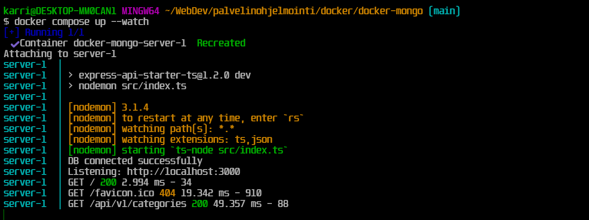
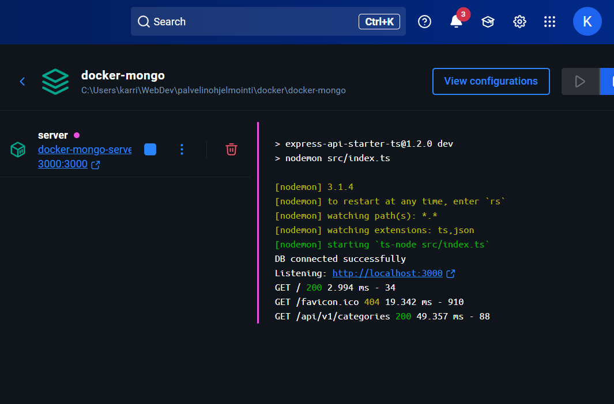
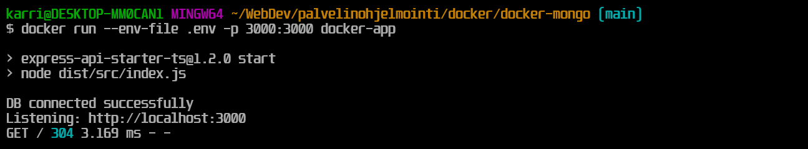
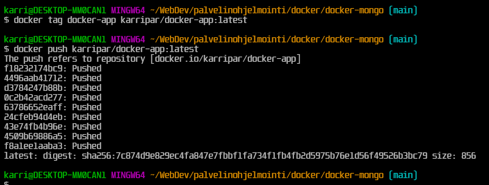
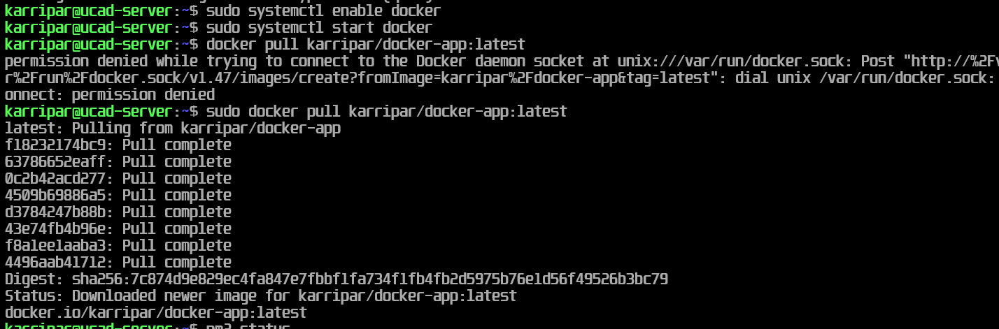
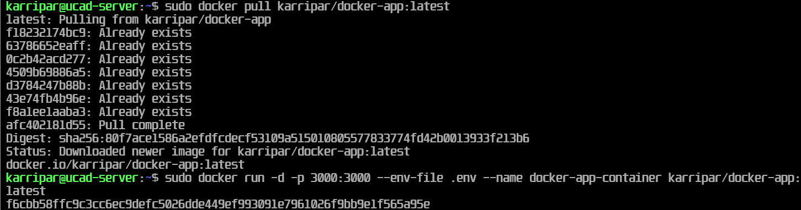
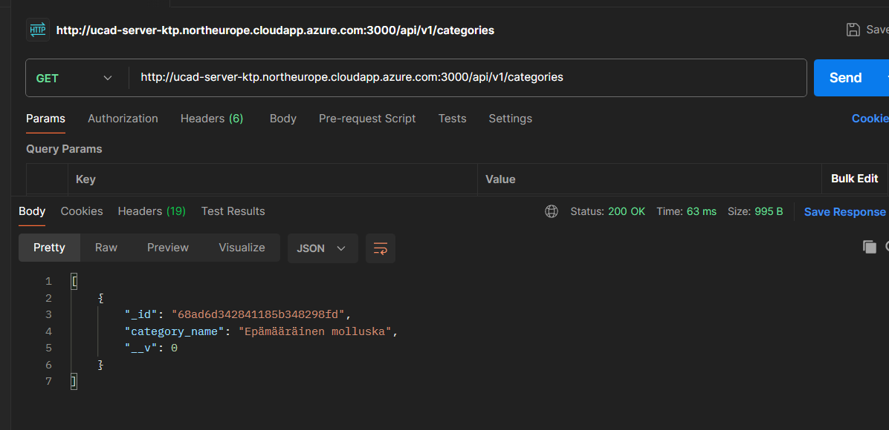

# Docker mongo app assignment. Creating a docker container with a pre-existing mongoose application.

### Initial process

- I copied the mongoose node app developed in the palvelinohjelmointi course.
- I installed required packages with `npm i`
- Ran `docker init`
- Chose what port to use (3000), project type (node) and generated the compose.yaml file, Dockerfile and readme files.
- Filled in the required environment variables such as the database address and passwords
- After configuring the compose files I tested the container by running `docker compose up --watch`

### Process in Docker Desktop

- I built the docker project with `docker build -t docker-app .`
- Tested the build with environment variables by running `docker run --env-file .env -p 3000:3000 docker-app`
- Well, and it works!

- Tagged my docker image and pushed it to the registry:

### Azure configuration
- `sudo apt update`
- Installed Docker with `sudo apt install -y docker.io`
- `sudo systemctl enable docker`
- `sudo systemctl start docker`

- Pulled the latest docker image from the registry
- Made it run loaded with the environment variables

